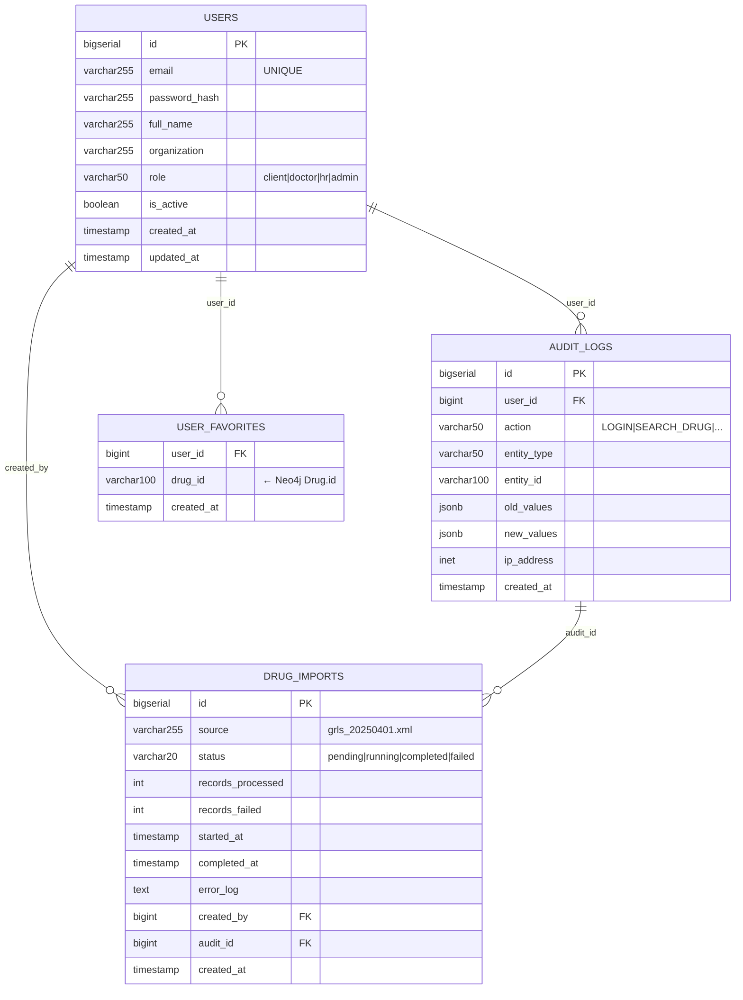
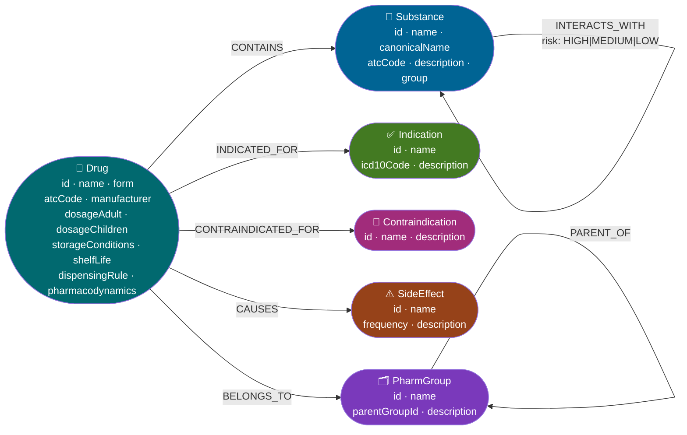

# Схема базы данных

Проект использует гибридную архитектуру БД:
- **PostgreSQL** — операционный слой (пользователи, аудит, ETL-импорты, избранное)
- **Neo4j** — медицинский knowledge graph (препараты, вещества, показания, противопоказания, побочные эффекты)

---

## PostgreSQL — ER-диаграмма



---

## PostgreSQL — DDL

```sql
CREATE TABLE users (
  id            BIGSERIAL PRIMARY KEY,
  email         VARCHAR(255) NOT NULL UNIQUE,
  password_hash VARCHAR(255) NOT NULL,
  full_name     VARCHAR(255) NOT NULL,
  organization  VARCHAR(255),
  role          VARCHAR(50)  NOT NULL CHECK (role IN ('client', 'doctor', 'hr', 'admin')),
  is_active     BOOLEAN      NOT NULL DEFAULT TRUE,
  created_at    TIMESTAMP    NOT NULL DEFAULT NOW(),
  updated_at    TIMESTAMP    NOT NULL DEFAULT NOW()
);

CREATE TABLE audit_logs (
  id          BIGSERIAL PRIMARY KEY,
  user_id     BIGINT REFERENCES users(id) ON DELETE SET NULL,
  action      VARCHAR(50)  NOT NULL,
  entity_type VARCHAR(50)  NOT NULL,
  entity_id   VARCHAR(100) NOT NULL,
  old_values  JSONB,
  new_values  JSONB,
  ip_address  INET,
  created_at  TIMESTAMP NOT NULL DEFAULT NOW()
);

CREATE TABLE drug_imports (
  id                BIGSERIAL PRIMARY KEY,
  source            VARCHAR(255) NOT NULL,
  status            VARCHAR(20)  NOT NULL CHECK (status IN ('pending', 'running', 'completed', 'failed')),
  records_processed INT          NOT NULL DEFAULT 0,
  records_failed    INT          NOT NULL DEFAULT 0,
  started_at        TIMESTAMP,
  completed_at      TIMESTAMP,
  error_log         TEXT,
  created_by        BIGINT REFERENCES users(id) ON DELETE SET NULL,
  audit_id          BIGINT REFERENCES audit_logs(id) ON DELETE SET NULL,
  created_at        TIMESTAMP NOT NULL DEFAULT NOW()
);

CREATE TABLE user_favorites (
  user_id    BIGINT      NOT NULL REFERENCES users(id) ON DELETE CASCADE,
  drug_id    VARCHAR(100) NOT NULL,
  created_at TIMESTAMP   NOT NULL DEFAULT NOW(),
  PRIMARY KEY (user_id, drug_id)
);

CREATE INDEX idx_audit_logs_user_id ON audit_logs(user_id);
CREATE INDEX idx_audit_logs_entity  ON audit_logs(entity_type, entity_id);
CREATE INDEX idx_drug_imports_status ON drug_imports(status);
```

---

## Neo4j — Граф знаний



### Узлы и свойства

| Узел | Свойства |
|---|---|
| `Drug` | `id`, `name`, `form`, `manufacturer`, `registrationNumber`, `atcCode`, `dosageAdult`, `dosageChildren`, `storageConditions`, `shelfLife`, `dispensingRule`, `pharmacodynamics` |
| `Substance` | `id`, `name`, `canonicalName`, `atcCode`, `description` |
| `Indication` | `id`, `name`, `icd10Code`, `description` |
| `Contraindication` | `id`, `name`, `description` |
| `SideEffect` | `id`, `name`, `frequency` (VERYCOMMON\|COMMON\|UNCOMMON\|RARE\|VERYRARE), `description` |
| `PharmacologicalGroup` | `id`, `name`, `parentGroupId`, `description` |

### Связи

| Связь | От → До | Свойства |
|---|---|---|
| `CONTAINS` | Drug → Substance | — |
| `INDICATED_FOR` | Drug → Indication | — |
| `CONTRAINDICATED_FOR` | Drug → Contraindication | — |
| `CAUSES` | Drug → SideEffect | — |
| `BELONGS_TO` | Drug → PharmGroup | — |
| `INTERACTS_WITH` | Substance → Substance | `risk: HIGH\|MEDIUM\|LOW` |
| `PARENT_OF` | PharmGroup → PharmGroup | — |

---

## Neo4j — Constraints и индексы

```cypher
CREATE CONSTRAINT drug_id IF NOT EXISTS
FOR (d:Drug) REQUIRE d.id IS UNIQUE;

CREATE CONSTRAINT substance_id IF NOT EXISTS
FOR (s:Substance) REQUIRE s.id IS UNIQUE;

CREATE CONSTRAINT indication_id IF NOT EXISTS
FOR (i:Indication) REQUIRE i.id IS UNIQUE;

CREATE CONSTRAINT contraindication_id IF NOT EXISTS
FOR (c:Contraindication) REQUIRE c.id IS UNIQUE;

CREATE CONSTRAINT sideeffect_id IF NOT EXISTS
FOR (s:SideEffect) REQUIRE s.id IS UNIQUE;

CREATE CONSTRAINT group_id IF NOT EXISTS
FOR (g:PharmacologicalGroup) REQUIRE g.id IS UNIQUE;
```

---

## Примеры Cypher-запросов

```cypher
-- Все вещества препарата и их взаимодействия
MATCH (d:Drug {id: "drug001"})-[:CONTAINS]->(s:Substance)
OPTIONAL MATCH (s)-[r:INTERACTS_WITH]->(s2:Substance)
RETURN d.name, s.name, r.risk, s2.name;

-- Аналоги по фармакологической группе
MATCH (d:Drug {id: "drug001"})-[:BELONGS_TO]->(g:PharmacologicalGroup)
      <-[:BELONGS_TO]-(analog:Drug)
WHERE analog.id <> d.id
RETURN analog.name, analog.form, analog.dispensingRule;

-- Препараты, противопоказанные при диагнозе МКБ-10
MATCH (d:Drug)-[:CONTRAINDICATED_FOR]->(c:Contraindication),
      (d)-[:INDICATED_FOR]->(i:Indication {icd10Code: "I10"})
RETURN d.name, collect(c.name) AS contraindications;

-- Частые побочные эффекты препарата
MATCH (d:Drug {id: "drug001"})-[:CAUSES]->(se:SideEffect)
WHERE se.frequency IN ["VERYCOMMON", "COMMON"]
RETURN se.name, se.frequency
ORDER BY se.frequency;
```

---

## Связь PostgreSQL ↔ Neo4j

Обе базы связаны через строковый `drug_id` (формат `drug001`, `drug002`, ...):
- `USER_FAVORITES.drug_id` ссылается на `Drug.id` в Neo4j
- `AUDIT_LOGS.entity_id` при `entity_type = 'drug'` также содержит Neo4j `Drug.id`
- NestJS API Gateway агрегирует данные обеих БД в единый DTO для React-клиента
